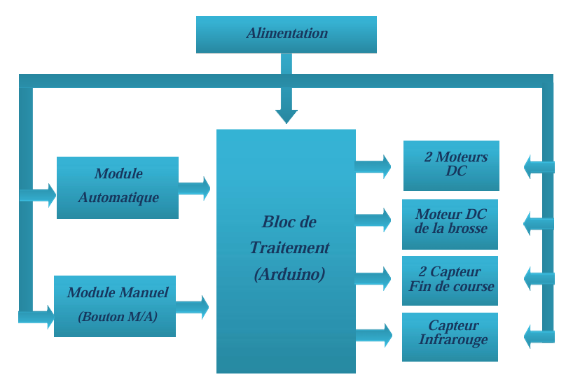
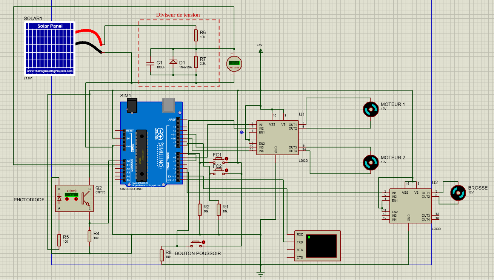
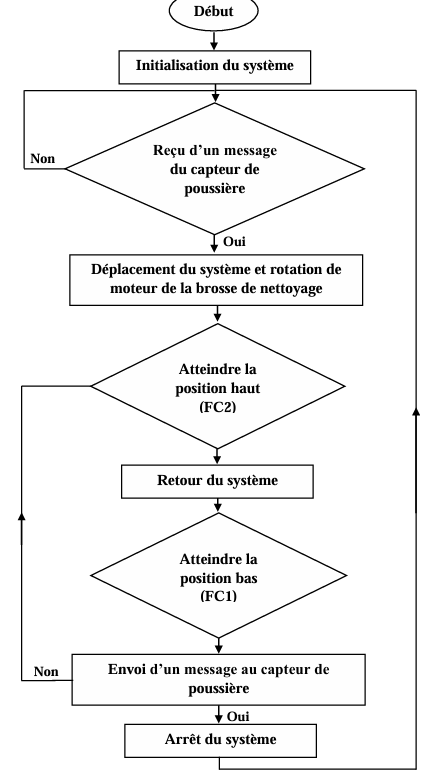
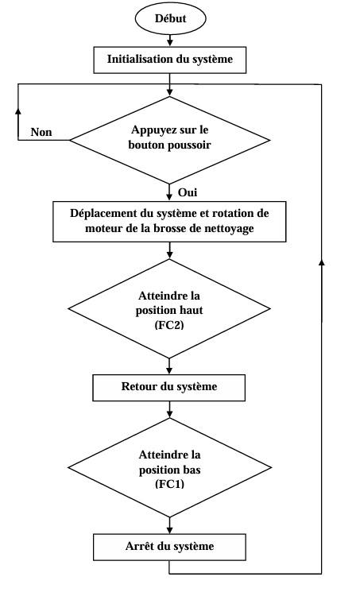
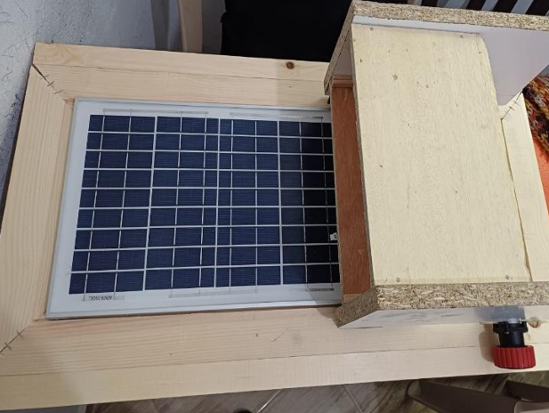
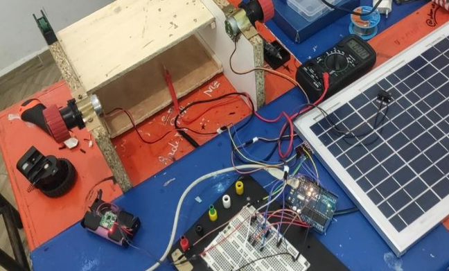
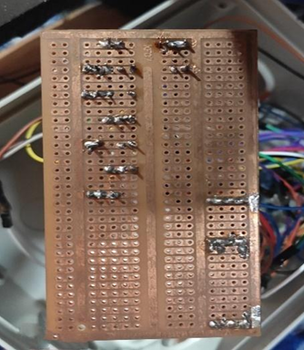
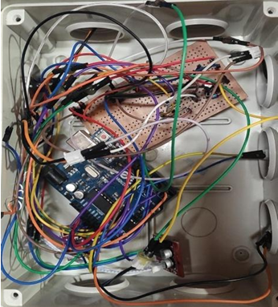
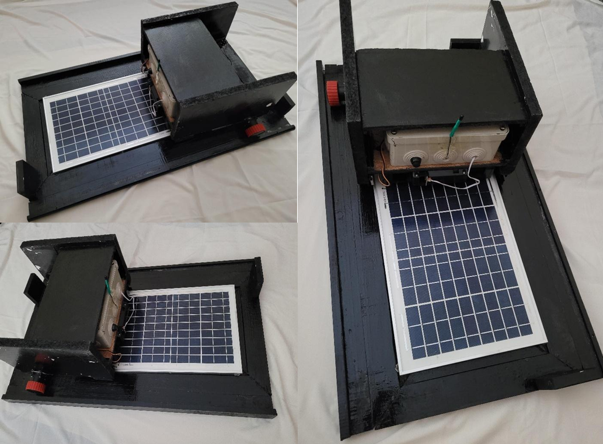

# 🤖 Solar Panel Cleaning Robot

## 📝 Description :
Ce projet consiste à concevoir et réaliser un robot automatique pour le nettoyage des panneaux solaires afin d'améliorer leur rendement.

## 👩‍💻 Réalisé par :
- El Azimani Chaimae
- Drissi Salma

## 📌 Problématique :
L'accumulation de poussière sur les panneaux solaires peut réduire leur rendement jusqu'à 79%. Ce robot propose une solution automatique et économique pour résoudre ce problème.

## 🎯 Objectifs :
- Réduire l’impact de la poussière sur les panneaux
- Automatiser le nettoyage
- Maintenir un rendement énergétique élevé

## ⚙️ Fonctionnement :

Le système fonctionne en deux modes :

- **Mode Automatique** :
  S'active automatiquement dès que le système détecte une baisse de rendement des panneaux solaires due à la saleté.  
  Le nettoyage s'effectue de bas en haut et s'arrête grâce aux capteurs de fin de course.

- **Mode Manuel** :
  Enclenché par un bouton poussoir, il permet à l'utilisateur de contrôler directement les mouvements du robot.

## 🛠️ Partie Matérielle (Hardware) :

## 🔌 Composants utilisés :

- **Carte Arduino** (unité de traitement)
- **3 moteurs DC** :
  - 2 pour déplacement
  - 1 pour la brosse
- **Capteurs** :
  - Capteurs fin de course
  - Capteur infrarouge
- **Driver moteur L298N**
- **Alimentation (batterie)**
- **Panneau solaire 10W**

## 🔗 Schéma synoptique :

  

## 🔌 Schéma de simulation (Proteus) :

  

## 💻 Partie Logicielle (Software) :

## 🧾 Outils utilisés :

| Logiciels | Utilisations |
|---|---|
| **Arduino IDE**  | Programmation du microcontrôleur |
| **Proteus ISIS** | Simulation du schéma électrique |
| **CoolTerm** | Monitoring série |

## ⚙️ Logique et Organigramme :

### 🔄 Mode Automatique :

  

### 🎮 Mode Manuel :

  

## 🔨 Réalisation du Prototype :

### Étape 1 — Assemblage mécanique :

  

### Étape 2 — Test sur plaque d'essai :

  

### Étape 3 — Soudage des composants :

  
  

### Étape 4 — Réalisation Finale :

  

## 📊 Résultats :
Tests effectués sur installation photovoltaïque réelle :

- Nettoyage efficace validé
- Rendement restauré après nettoyage
- Deux modes de fonctionnement opérationnels

## 🚀 Améliorations possibles :

-  Intégration complète d’un panneau solaire pour autonomie énergétique
-  Ajout d’un module IoT (ESP8266 / ESP32) pour contrôle à distance
-  Développement d’une application mobile
-  Intégration de l’intelligence artificielle pour détection avancée de saleté
-  Optimisation de la consommation énergétique

## 🚀 Conclusion
Solution simple, efficace et économique pour le nettoyage des panneaux solaires, permettant d’améliorer significativement leur rendement.
